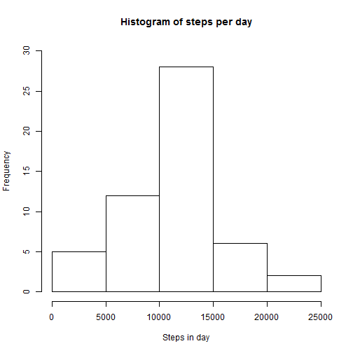
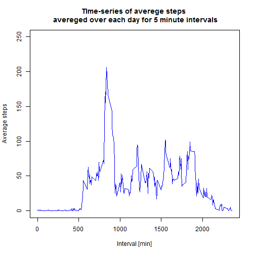
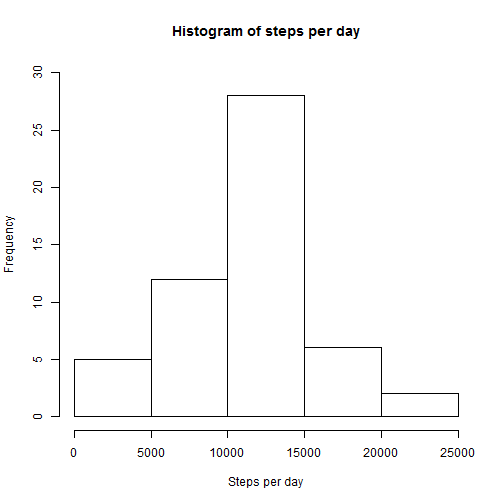
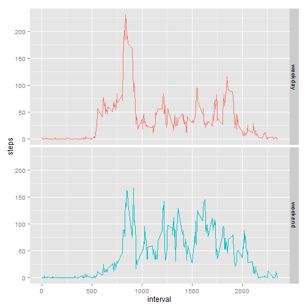

  
Loading and preprocessing the data
  

```r
activity_ds <- read.csv("activity.csv", stringsAsFactors = F, header = T)
activity_ds[, "date"] <- as.Date(activity_ds[, "date"], "%Y-%m-%d")
```
  
What is mean total number of steps taken per day?


```r
total_steps <- aggregate(steps ~ date, activity_ds, FUN = sum)
hist(total_steps[, "steps"],  ylim = c(0, 30), xlab = "Steps in day", main = "Histogram of steps per day")
```

 

```r
mean(total_steps[, "steps"])
```

```
## [1] 10766.19
```

```r
median(total_steps[, "steps"])
```

```
## [1] 10765
```

What is the average daily activity pattern?


```r
average_steps <- round(aggregate(steps ~ interval, activity_ds, FUN = mean))
plot(unique(activity_ds[, "interval"]), average_steps[, "steps"], type = "l", 
     ylim = c(0, 250), xlab = "Interval [min]", ylab = "Average steps", col = "blue",
     main = "TIme-series of averege steps \n avereged over each day for 5 minute intervals")
```

 

```r
subset(average_steps, steps == max(average_steps["steps"]), select = interval, drop = T)
```

```
## [1] 835
```

Imputing missing values


```r
na_s <- sum(is.na(activity_ds[, "steps"]))
na_s
```

```
## [1] 2304
```

```r
na_activity <- activity_ds[is.na(activity_ds$steps) == T, c("steps", "interval")]
na_activity_index <- which(is.na(activity_ds$steps == T))
na_activity_2 <- vector()
for (i in 1:length(na_activity_index)) {
        for (j in 1:length(average_steps[, "steps"])) {
                if (na_activity[i, "interval"] == average_steps[j, "interval"]) {
                        na_activity_2[i] <- average_steps[j, "steps"] 
                }
        }
}

steps <- activity_ds$steps
new_steps <- as.vector(replace(steps, na_activity_index, na_activity_2))
new_activity <- activity_ds
new_activity[, "steps"] <- new_steps
total_steps_2 <- aggregate(steps ~ date, new_activity, FUN = sum)
hist(total_steps$steps, xlab = "Steps per day", main = "Histogram of steps per day", ylim = c(0, 30))
```

 

```r
mean(total_steps_2$steps)
```

```
## [1] 10765.64
```

```r
median(total_steps_2$steps)
```

```
## [1] 10762
```

Are there differences in activity patterns between weekdays and weekends?


```r
new_activity$date <- weekdays(new_activity$date, F)

# days are in croatian
weekday <- c("ponedjeljak", "utorak", "srijeda", "èetvrtak", "petak")
weekend <- c("subota", "nedjelja")
new_activity[new_activity$date %in% weekday, "date"] <- "weekday"
new_activity[new_activity$date %in% weekend, "date"] <- "weekend"

steps_weekdays <- aggregate(steps ~ interval + date, new_activity, FUN = mean)
library(ggplot2)
gg <- ggplot(steps_weekdays, aes(x = interval, y = steps, col = date)) + geom_line()
gg + theme(legend.position = "none") + facet_grid(date ~ .) 
```

 
